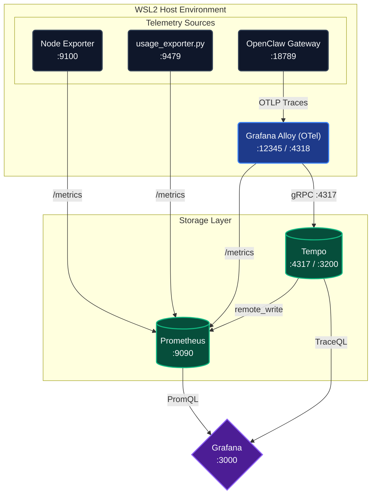
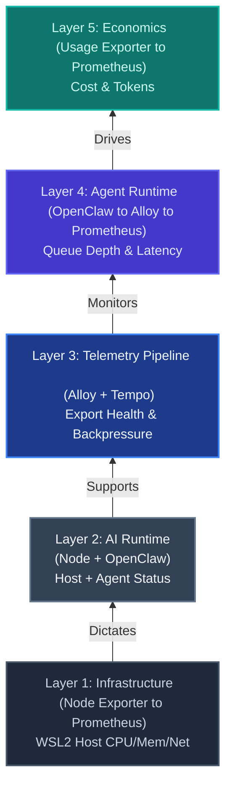
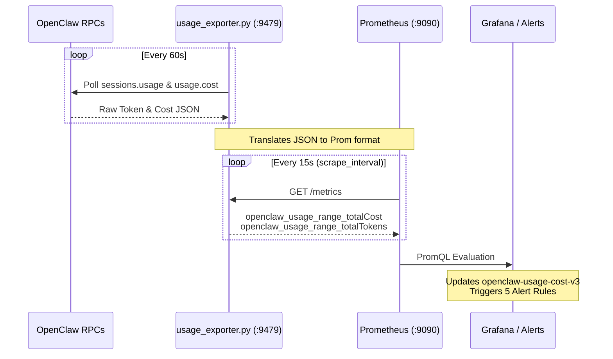

# Observability — Monitoring Your OpenClaw Agent

Five-layer monitoring stack covering host health, telemetry pipeline, agent runtime, and cost economics.

This guide is a companion to the [Security Guide](security.md). The agent should be hardened before instrumenting it.

**Environment tested on:** WSL2 · Ubuntu 24.04.4 LTS · Grafana 12.4.1 · Alloy 1.14.0 · Tempo 2.10.1

---

## Architecture

Five independent signal paths all flow into Grafana. Each path solves a different observability problem — none of them overlap.



!!! important
    Runtime telemetry and economics telemetry are not the same thing. OpenTelemetry signals give you pipeline health and trace flow. Cost and token data lives in OpenClaw's native usage RPCs. Neither replaces the other.

---

## Five-Layer Stack

Each layer answers a different question. A failure at any layer is invisible to the layers below it.



### Key roles

| Component | Role |
|:----------|:-----|
| **Node Exporter** | Host metrics — CPU, memory, disk, network |
| **Grafana Alloy** | OpenTelemetry collector — routes spans and metrics |
| **Tempo** | Trace backend — stores distributed traces |
| **Prometheus** | Metrics store — scrapes all exporters |
| **Grafana** | Visualisation — all dashboards live here |
| **usage_exporter.py** | Custom exporter — pulls OpenClaw usage RPCs, exposes on `:9479` |

### Ports

| Port | Service |
|:-----|:--------|
| 3000 | Grafana |
| 9090 | Prometheus |
| 9100 | Node Exporter |
| 4317 | Tempo gRPC (OTLP) |
| 4318 | OTLP HTTP receiver |
| 3200 | Tempo HTTP |
| 12345 | OpenClaw / Alloy metrics endpoint |
| 9479 | usage_exporter.py |

---

## Baseline Issues Found

This is what was wrong at the start — documenting it so you know what to verify on a fresh setup.

### A. Tempo missing

Alloy logs showed repeated failures:

```
Exporting failed dial tcp 127.0.0.1:4317: connect: connection refused
Dropping data
```

Tempo was not installed. Alloy was trying to export traces to it and silently dropping everything.

### B. Prometheus underconfigured

Prometheus was only scraping itself and OpenClaw (`localhost:12345`). It was **not scraping Node Exporter** even though `node_exporter` was running on `:9100`.

### C. Grafana provisioning minimal

Only sample provisioning files existed. Grafana had no meaningful dashboards or datasources configured as code.

---

## Fix 1 — Install and wire Tempo

```bash
# Install Tempo
sudo apt install -y tempo
sudo systemctl enable tempo
sudo systemctl start tempo

# Verify Tempo is listening
ss -ltnp | grep ':4317'  # Should show tempo
ss -ltnp | grep ':3200'  # Should show tempo

# Check Tempo logs
journalctl -u tempo --no-pager -n 40
```

After install, Tempo logs should show:

```
gRPC server listening on :4317
HTTP server listening on :3200
```

---

## Fix 2 — Tempo `remote_write` hostname

Tempo's default config uses a Docker-style hostname that breaks on bare WSL2.

```bash
sudo nano /etc/tempo/config.yml
```

Find and fix:

```yaml
# WRONG — Docker hostname, breaks on WSL2
remote_write:
  - url: http://prometheus:9090/api/v1/write

# CORRECT
remote_write:
  - url: http://localhost:9090/api/v1/write
```

```bash
sudo systemctl restart tempo
journalctl -u tempo --no-pager -n 20
# Should no longer show: lookup prometheus / no such host
```

---

## Fix 3 — Prometheus scrape config

Add Node Exporter and the usage exporter to Prometheus:

```bash
sudo nano /etc/prometheus/prometheus.yml
```

```yaml
global:
  scrape_interval: 15s
  evaluation_interval: 15s

scrape_configs:
  - job_name: 'prometheus'
    static_configs:
      - targets: ['localhost:9090']

  - job_name: 'openclaw'
    static_configs:
      - targets: ['localhost:12345']

  - job_name: 'node'
    static_configs:
      - targets: ['localhost:9100']

  - job_name: 'openclaw_usage'
    static_configs:
      - targets: ['localhost:9479']
```

Always validate before restarting:

```bash
promtool check config /etc/prometheus/prometheus.yml
sudo systemctl restart prometheus

# Verify all targets are up
curl -s http://127.0.0.1:9090/api/v1/targets | python3 -m json.tool | grep -A2 '"health"'
```

All four jobs should show `"health": "up"`.

!!! warning
    Never use `sudo printf ... > /etc/prometheus/prometheus.yml`. The `>` redirect runs as your non-sudo shell and will fail with permission denied or silently truncate the file. Always use `| sudo tee` or edit directly with `sudo nano`.

---

## Fix 4 — Add Tempo datasource to Grafana

1. Grafana UI → **Connections → Data Sources → Add data source**
2. Select **Tempo**
3. URL: `http://localhost:3200`
4. **Save & Test** — should show green

Prometheus datasource (`http://localhost:9090`) should already exist.

---

## Fix 5 — Start usage_exporter.py

The `usage_exporter.py` script pulls OpenClaw's native usage RPCs and exposes them as Prometheus metrics on `:9479`.

```bash
# Run in background
nohup python3 /path/to/usage_exporter.py &

# Verify it's healthy
curl http://localhost:9479/healthz
curl -s http://localhost:9479/metrics | grep openclaw_usage | head -20
```

---

## Layer 1 — WSL2 Host + Network Health

**Dashboard:** `wsl2-host-network-health.json`

**Purpose:** Infrastructure baseline. Eliminates the host as a suspect before investigating the agent stack.

| Panel | Signal |
|:------|:-------|
| CPU Used % | `node_cpu_seconds_total{mode="idle"}` |
| Memory Used % | `node_memory_MemAvailable_bytes / node_memory_MemTotal_bytes` |
| Root Disk Used % | `node_filesystem_avail_bytes / node_filesystem_size_bytes` |
| Targets Down | `sum(1 - up{job=~"prometheus|openclaw|node"})` |
| Network Throughput | RX / TX bytes/sec, excluding loopback and veth |
| Connection Pressure | TCP established + conntrack entries |
| Network Errors / Drops | RX/TX drops and errors per second |
| Uptime & Load | `node_load1`, `node_load5`, uptime seconds |

---

## Layer 2 — Infra + AI Runtime Combined

**Dashboard:** `infra-plus-aiops-dashboard.json`

**Purpose:** One view bridging machine health and agent activity. Fastest triage starting point.

| Panel | Signal |
|:------|:-------|
| Host CPU / Memory / Disk | node_exporter fundamentals |
| Failed Targets | `sum(up{job=~"prometheus|openclaw|node"} == 0)` |
| Network Throughput | Host RX/TX |
| Host Uptime | `node_time_seconds - node_boot_time_seconds` |
| OpenClaw Throughput | `claw_messages_processed_total` |
| AI Runtime Pressure | `claw_queue_depth`, `claw_session_stuck_total` |

---

## Layer 3 — Telemetry Pipeline Health

Two dashboards cover this layer.

=== "OTel Pipeline Health"

    **Dashboard:** `otel-pipeline-health.json`

    | Panel | Signal |
    |:------|:-------|
    | Alloy Config Healthy | `alloy_config_last_load_successful` |
    | Healthy Alloy Components | `alloy_component_controller_running_components` |
    | Alloy Eval Queue | `alloy_component_evaluation_queue_size` |
    | Accepted Spans/sec | `rate(otelcol_receiver_accepted_spans_total[5m])` |
    | OTLP Receiver Span Flow | accepted / refused / failed spans |
    | Exporter Health & Backpressure | sent / send failed / queue size |
    | Telemetry Process Memory | Alloy + Tempo resident memory |
    | Tempo Ingest Signals | distributor spans / receiver accepted / discarded |

=== "OpenClaw Observability Hero"

    **Dashboard:** `openclaw-observability-hero.json`

    **Purpose:** Telemetry-pipeline-level observability for OpenClaw specifically — watching the watcher.

    | Panel | Signal |
    |:------|:-------|
    | Telemetry Config Healthy | Alloy config load success |
    | Alloy Evaluation Queue | Queue depth |
    | Accepted / Sent Spans/sec | Receiver + exporter throughput |
    | OTLP HTTP Requests by Status | `http_server_request_duration_seconds` by status code |
    | OTLP Receiver Latency | p50 / p95 / p99 |
    | Collector Resource Footprint | Alloy resident + virtual memory, host RX/TX |

    !!! warning
        If the collector or export path is broken, your observability is an illusion. This dashboard is where you detect that.

---

## Layer 4 — Agent Runtime Observability

**Dashboard:** `openclaw-runtime-dashboard.json`

**Purpose:** Operational health of the agent — not just "is it alive" but "is it healthy".

| Panel | Signal |
|:------|:-------|
| Stuck Sessions | `claw_session_stuck_total` |
| Queue Depth | `claw_queue_depth` |
| Messages/sec (5m) | `rate(claw_messages_processed_total[5m])` |
| Queue Wait p95 | 95th percentile queue wait time |
| Message Throughput by Kind | Split by message kind |
| Queue Wait Quantiles | p50 / p95 / p99 — `claw_queue_wait_seconds` |

!!! tip
    The p50/p95/p99 latency panels are the signal that tells you whether the agent is degraded before your users notice.

---

## Layer 5 — Economics (Cost + Token Monitoring)

### Economics Pipeline



### Key metrics

| Metric | Description |
|:-------|:------------|
| `openclaw_usage_range_totalCost` | Total cost for the day (USD) |
| `openclaw_usage_range_totalTokens` | Total tokens for the day |
| `openclaw_session_total_cost_usd` | Per-session total cost |
| `openclaw_session_total_tokens` | Per-session total tokens |
| `openclaw_usage_model_totalCost` | Cost split by model |
| `openclaw_usage_channel_totalCost` | Cost split by channel |

### Alert rules

| Rule | Threshold |
|:-----|:----------|
| `OpenClawDailyCostHigh` | Daily cost > $10 |
| `OpenClawDailyCostCritical` | Daily cost > $20 |
| `OpenClawSingleSessionCostSpike` | Any session > $5 |
| `OpenClawTokenBurnHigh` | > 1.5M tokens in 30 min |
| `OpenClawExporterDown` | Exporter unhealthy |

!!! warning
    Thresholds that look sensible on paper will fire immediately against real usage. Calibrate against at least one full day of live traffic before treating these as pages.

---

## OpenClaw Usage UI

Before building Grafana panels for token/cost data, check the native OpenClaw UI first:

```
http://127.0.0.1:18789/usage
```

The control UI exposes these usage RPC methods natively:

- `sessions.usage` — per-session token/cost breakdown
- `usage.cost` — total cost by period
- `sessions.usage.timeseries` — usage over time
- `sessions.usage.logs` — per-turn logs with model/token/cost detail

!!! tip
    Use the **OpenClaw Usage UI** for ad-hoc exploration and screenshots of token/cost/session/model data — it's the fastest way to answer "what did I spend today?". Use **Grafana** (via `usage_exporter.py`) for the same economics data when you need alerting, time-series trending, and correlation with host or pipeline signals. Both serve different jobs: native UI for inspection, Grafana for automation and history.
---

## Dashboard Import Guide

Grafana provisioning-as-code is fragile to set up initially. The pragmatic path:

1. Grafana UI → **Dashboards → Import**
2. Paste the JSON content from the dashboard files in this repo
3. Select the correct datasource (Prometheus or Tempo) when prompted
4. Repeat for each of the 8 dashboards

!!! note
    Build dashboards only against metrics confirmed to exist. Early dashboards built with assumed metric names produced empty panels and nonsense values. Always run `curl -s http://127.0.0.1:12345/metrics` to inventory real metrics first.

---

## Troubleshooting

### Tempo native histogram mismatch

**Symptom:** Tempo logs show `native histograms are disabled`.

**Fix:** Set `generate_native_histograms: none` in `/etc/tempo/config.yml`. Restart Tempo.

### Prometheus not scraping usage exporter

**Symptom:** `up{job="openclaw_usage"}` returns empty or 0.

1. `curl http://localhost:9479/healthz` — is the exporter running?
2. Is the scrape job in `prometheus.yml`?
3. Run `promtool check config` and restart

### Alloy exporter backpressure

```bash
journalctl -u alloy --no-pager -n 60
```

Look for `send_failed` or `queue_size` growing. Usually means Tempo is down or unhealthy.

### YAML indentation corruption

Always run `promtool check config` before restarting. Use `sudo tee` not `sudo >` for privileged writes.

### Grafana provisioning fails / panels blank

Import dashboard JSON manually via Grafana UI → Dashboards → Import.

---

## Useful Commands

```bash
# Prometheus targets
curl -s http://127.0.0.1:9090/api/v1/targets

# Alloy logs
journalctl -u alloy --no-pager -n 60

# Tempo logs
journalctl -u tempo --no-pager -n 80

# Tempo config
sudo sed -n '1,120p' /etc/tempo/config.yml

# Validate Prometheus config
promtool check config /etc/prometheus/prometheus.yml

# OpenClaw / Alloy metrics
curl -s http://127.0.0.1:12345/metrics

# Node exporter metrics
curl -s http://127.0.0.1:9100/metrics

# Tempo metrics
curl -s http://127.0.0.1:3200/metrics

# Usage exporter health
curl http://localhost:9479/healthz
```

---

## Key Lessons

1. **Installed ≠ wired** — Tempo was installed but Alloy silently dropped traces until it was properly connected
2. **Open port ≠ healthy pipeline** — trace the full signal path end-to-end
3. **Validate config before restart** — `promtool check config` every time
4. **Docker hostnames break outside Docker** — Tempo's default `http://prometheus:9090` DNS fails on bare WSL2
5. **Inventory real metrics first** — build dashboards against confirmed metrics, not assumed ones
6. **Don't fake what already exists** — if OpenClaw Usage UI already shows token/cost data natively, use it

---

## Operational Checklist

- [ ] Tempo installed and listening on `:4317` and `:3200`
- [ ] Tempo `remote_write` URL uses `localhost` not `prometheus`
- [ ] `usage_exporter.py` running on `:9479`
- [ ] Prometheus scraping all 4 jobs (`up = 1`): `prometheus`, `openclaw`, `node`, `openclaw_usage`
- [ ] All 5 alert rules loaded and evaluating
- [ ] All 8 dashboard JSONs imported into Grafana
- [ ] Tempo datasource added (`http://localhost:3200`) and tested green
- [ ] Alloy config loaded successfully
- [ ] No persistent exporter backpressure errors in Alloy logs
- [ ] Alert thresholds calibrated against real traffic

---

## Related Guides

- [Security Guide](security.md) — harden the agent before instrumenting it
- [Troubleshooting](troubleshooting.md) — OpenClaw errors, DNS, Docker, Codex quota
- [Skills Guide](skills.md) — safe skill installation
