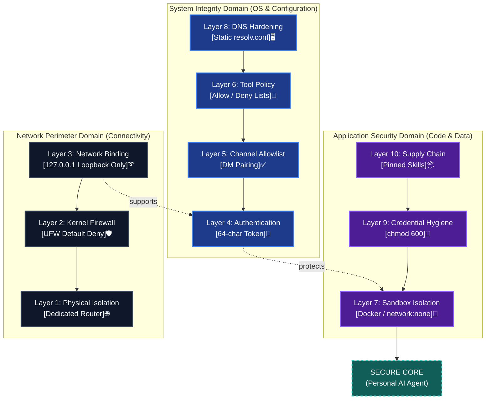
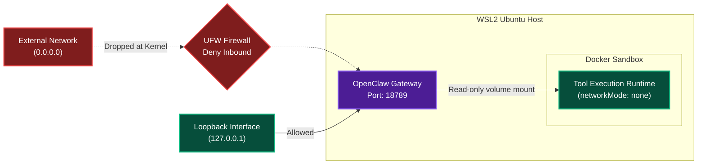
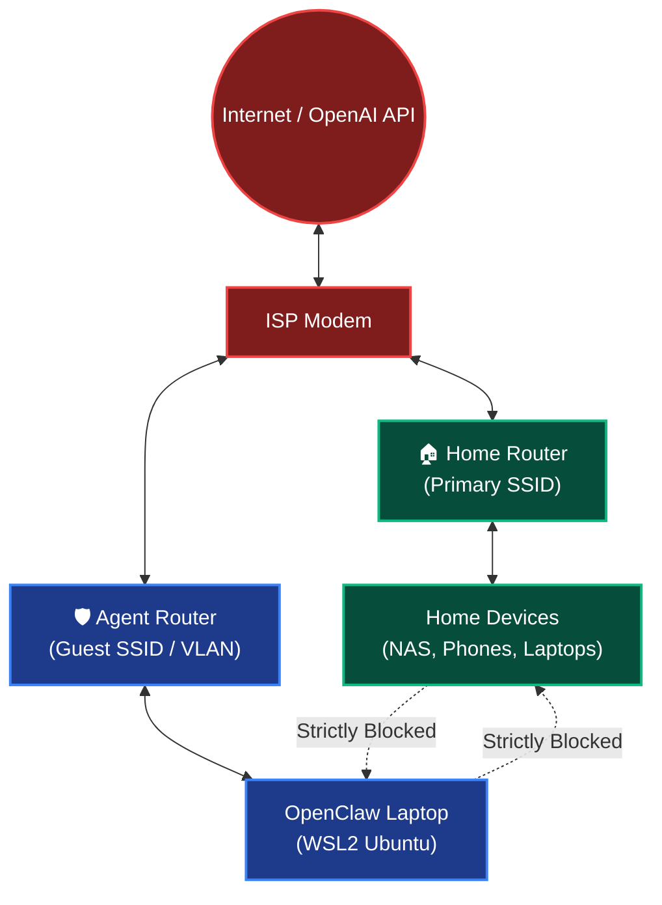

# Security-Hardened Deployment Guide

Complete walkthrough from WSL2 setup to a fully hardened personal AI agent deployment.

**Model tested against:** OpenAI Codex (GPT-5.4) — *See [docs.openclaw.ai](https://docs.openclaw.ai) for current model support.*

!!! tip
    A full five-layer observability stack accompanies this guide. See the [Observability Guide](observability.md) for Prometheus, Grafana, Tempo, and cost monitoring.

---

## The 10-Layer Defence Stack

The diagram below models the full dependency chain of OpenClaw's security posture. Each layer builds on the one below — if the network or kernel layers (L1/L2) fail, the application-layer security (L6/L7) remains intact.



---

## Part 1 — Prerequisites

### 1.1 Hardware

Any x86-64 machine running Windows 10/11. A recycled laptop works perfectly.

- Windows 10/11 (WSL2 capable)
- ChatGPT Plus account (for OpenAI Codex / GPT-5.4 via OAuth)
- Telegram account (for bot creation via @BotFather)
- Basic comfort with a Linux terminal

### 1.2 Install WSL2 + Ubuntu

```powershell
# PowerShell as Administrator
wsl --install
wsl --set-default-version 2
```

Open Ubuntu from Start, then:

```bash
sudo apt update && sudo apt upgrade -y
sudo apt install -y curl wget git nano ufw dnsutils
```

### 1.3 WSL2 DNS Hardening (optional but recommended)

WSL2 regenerates `/etc/resolv.conf` on every restart by default. This can break Telegram API resolution after system updates.

```bash
# Prevent WSL2 from overwriting DNS
echo -e "[network]\ngenerateResolvConf = false" | sudo tee /etc/wsl.conf

# Set static DNS
sudo rm /etc/resolv.conf
echo -e "nameserver 8.8.8.8\nnameserver 8.8.4.4" | sudo tee /etc/resolv.conf

# Lock the file (optional extra hardening)
sudo chattr +i /etc/resolv.conf
```

Verify:

```bash
cat /etc/resolv.conf          # Should show 8.8.8.8
dig api.telegram.org          # Should resolve
```

!!! note
    OpenAI APIs and other external services also depend on reliable DNS. This fix resolves both.

---

## Part 2 — Install OpenClaw

```bash
# Review the install script before running (always)
curl -fsSL https://openclaw.ai/install.sh -o install.sh
less install.sh
bash install.sh
source ~/.bashrc

# Verify installation
openclaw --version
openclaw doctor
```

!!! note
    OpenClaw releases frequently. The onboarding wizard and CLI commands shown here reflect the state at time of setup. Check [docs.openclaw.ai](https://docs.openclaw.ai) for changes.

---

## Part 3 — Security Configuration

### 3.1 Onboarding Wizard

Run the onboarding wizard and install the gateway daemon:

```bash
openclaw onboard --install-daemon
```

When prompted:

- Select **OpenAI Codex** as your AI provider
- Authenticate via **ChatGPT Plus OAuth** (no API key needed for Plus users)
- Configure your Telegram bot token (from @BotFather)
- Enable **gateway as background service**

!!! note
    **API key users:** If you use a platform.openai.com API key instead of OAuth, set it during onboarding. Monitor your billing limit at platform.openai.com.

### 3.2 Authentication Token

Generate a cryptographically strong authentication token:

```bash
openclaw auth token generate --length 64
```

This token authenticates every API call to your local gateway. 64 characters = 384 bits of entropy.

### 3.3 Channel Allowlist

Restrict access to your Telegram chat only:

```bash
# Get your Telegram chat ID
openclaw telegram get-chat-id

# Lock to your DM only
openclaw config set security.allowedChannels '["telegram:YOUR_CHAT_ID"]'
openclaw config set security.requireDMPairing true
```

### 3.4 Tool Policy

Enable explicit allow/deny lists for tool execution:

```bash
openclaw config set tools.policy.mode "allowlist"
openclaw config set tools.policy.allowedTools '["read_file","write_file","run_command","search_web"]'
```

---

## Part 4 — Credential Security

### 4.1 File Permissions

```bash
chmod 600 ~/.openclaw/openclaw.json
chmod 600 ~/.openclaw/auth-profiles.json
chmod 700 ~/.openclaw/
```

Verify:

```bash
ls -la ~/.openclaw/
```

### 4.2 What the Config File Contains

Your `~/.openclaw/openclaw.json` contains:

- Your 64-character authentication token
- Your Telegram bot token
- Your AI provider credentials (OAuth token or API key)
- Channel allowlists and tool policy

Never commit this file. It is excluded by `.gitignore` in this repo.

### 4.3 Spend Cap

For ChatGPT Plus users (OAuth), Codex quota is managed by your Plus subscription (5 hrs/day). For API key users:

```bash
# Set a hard monthly spend limit at platform.openai.com
# Billing → Usage limits → Set hard limit (e.g. AUD $20/month)
```

### 4.4 Key Rotation Protocol

```bash
# Rotate OpenClaw auth token
openclaw auth token rotate

# For API key users — rotate at platform.openai.com
# Keys → Revoke old key → Create new key → Update openclaw.json
openclaw config set providers.openai.apiKey "sk-..."
```

Rotation schedule: Rotate if a device is lost, a key is exposed, or quarterly as routine hygiene.

---

## Part 5 — Supply Chain Security

See the full [Skills Guide](skills.md) for safe skill installation.

Key principles:

- **Review before install** — check clawhub.ai for community feedback and version history
- **Never install from unreviewed sources** — the ClawHavoc campaign showed how easy it is to publish malicious skills
- **Version-pin** — use the lockfile at `.clawhub/lock.json`, never rely on `latest`
- **Update consciously** — review changelogs before `clawhub update`

---

## Part 6 — Sandbox Mode (Docker)

Sandbox mode runs tool execution inside Docker containers with no host access and no network.

```bash
# Install Docker
sudo apt install -y docker.io
sudo usermod -aG docker $USER
# Log out and back in, then:
docker run hello-world

# Enable sandbox in OpenClaw
openclaw config set sandbox.enabled true
openclaw config set sandbox.driver "docker"
openclaw config set sandbox.docker.networkMode "none"
openclaw config set sandbox.docker.readOnlyRootFilesystem true
```

Verify:

```bash
openclaw security audit --deep
```

### Gateway & Sandbox Execution Architecture

The diagram below demonstrates the interaction between UFW, the loopback interface, the gateway daemon, and the Docker execution environment. It visually proves that the sandbox lacks network access.



---

## Part 7 — Physical Network Isolation

For maximum isolation, run the agent on a **dedicated network segment** separate from your home network.



This means:

- Agent can reach the internet (OpenAI Codex API, system updates)
- Agent **cannot reach** home devices (NAS, printers, other laptops)
- Home devices **cannot reach** the agent

Any consumer router with a guest network or separate SSID achieves this.

---

## Part 8 — UFW Firewall

```bash
# Default deny all inbound
sudo ufw default deny incoming
sudo ufw default allow outgoing

# Allow only what you need
sudo ufw allow ssh          # If you SSH into this machine
sudo ufw enable

# Verify
sudo ufw status verbose
```

The gateway binds to loopback only (`127.0.0.1:18789`) by default, so it has zero external surface even without UFW. UFW is defence-in-depth.

```bash
# Confirm loopback binding
ss -tlnp | grep 18789
# Should show: 127.0.0.1:18789
```

---

## Part 9 — Health Monitoring

### 9.1 Built-in Health Check

```bash
openclaw health --json
openclaw doctor
```

### 9.2 External Monitoring with healthchecks.io

healthchecks.io provides external crash detection — if your machine or gateway goes down and stops pinging, you get alerted.

1. Create a free account at [healthchecks.io](https://healthchecks.io)
2. Create a check — set period to 5 minutes, grace period to 10 minutes
3. Copy the ping URL (`https://hc-ping.com/YOUR_UUID`)

```bash
# Test the ping manually
curl -fsS https://hc-ping.com/YOUR_UUID

# Add to crontab (every 5 minutes)
crontab -e
# Add: */5 * * * * /usr/local/bin/openclaw health --quiet && curl -fsS https://hc-ping.com/YOUR_UUID
```

!!! tip
    For the full observability stack (Prometheus, Grafana, Tempo, cost monitoring) see the [Observability Guide](observability.md).

---

## Part 10 — Security Audit

```bash
# Full deep security audit
openclaw security audit --deep

# Check all config
openclaw doctor

# Review what's exposed
ss -tlnp
sudo ufw status verbose
ls -la ~/.openclaw/
```

---

## Security Checklist — Complete Verification

=== "Prerequisites"
    - [ ] WSL2 installed and Ubuntu updated
    - [ ] OpenClaw installed and doctor passes

=== "Authentication"
    - [ ] 64-char auth token generated
    - [ ] Channel allowlist restricted to your Telegram DM
    - [ ] DM pairing enabled

=== "Network"
    - [ ] UFW enabled with default deny inbound
    - [ ] Gateway binding confirmed on loopback only (`127.0.0.1:18789`)
    - [ ] DNS hardening applied (if configured)

=== "Credentials"
    - [ ] `openclaw.json` permissions: `chmod 600`
    - [ ] `auth-profiles.json` permissions: `chmod 600`
    - [ ] ChatGPT quota monitored OR platform.openai.com billing limit set
    - [ ] Rotation protocol documented

=== "Sandbox"
    - [ ] Docker installed and accessible
    - [ ] Sandbox mode enabled (docker, no network)
    - [ ] Security audit passes: `openclaw security audit --deep`

=== "Supply Chain"
    - [ ] Only reviewed skills installed
    - [ ] Lockfile committed (`.clawhub/lock.json`)
    - [ ] No unreviewed skill sources

=== "Monitoring"
    - [ ] healthchecks.io external ping configured
    - [ ] Observability stack deployed — see Observability Guide
    - [ ] Alert thresholds calibrated

=== "Ongoing"
    - [ ] Pre-commit secret scan in workflow
    - [ ] Key rotation schedule set
    - [ ] Security audit run after every config change

---

## Troubleshooting

For common errors (DNS, Docker, gateway, Codex quota), see the dedicated [Troubleshooting Guide](troubleshooting.md).
