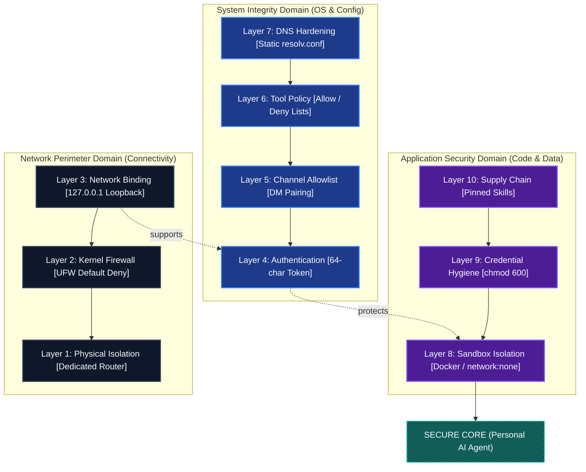
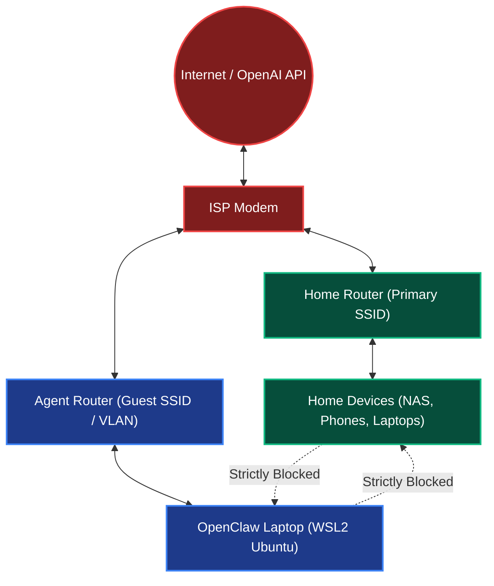
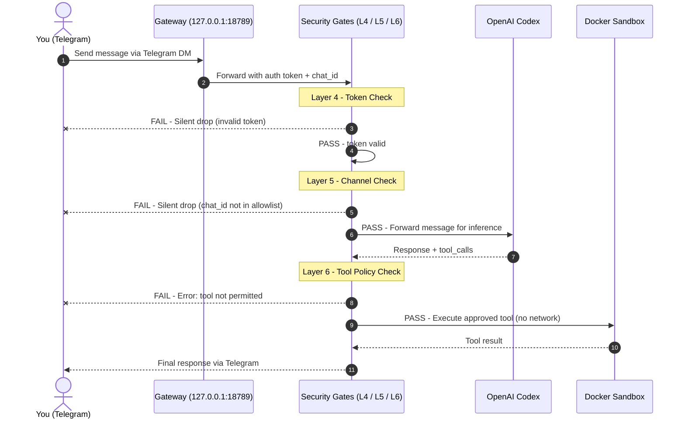
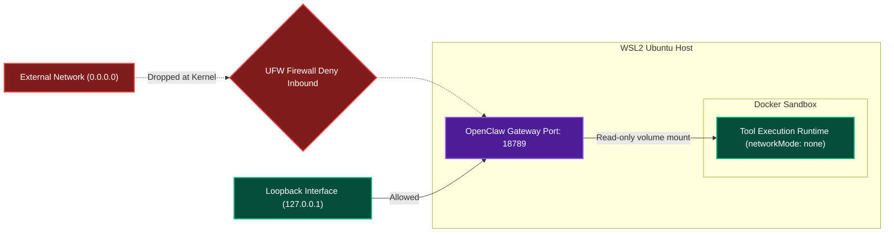

# Security-Hardened Deployment Guide

Complete walkthrough from WSL2 setup to a fully hardened personal AI agent deployment.

**Model tested against:** OpenAI Codex (GPT-5.4) - *See [docs.openclaw.ai](https://docs.openclaw.ai) for current model support.*

!!! tip
    A full five-layer observability stack accompanies this guide. See the [Observability Guide](observability.md) for Prometheus, Grafana, Tempo, and cost monitoring.

---

## The 10-Layer Defence Stack

The diagram below models the full dependency chain of OpenClaw's security posture, numbered in the order you set them up. Physical isolation comes first; supply chain hardening is the final lock.



---

## Part 1 - Physical Network Isolation (Layer 1)

Set up a dedicated network segment for the agent before anything else. This is the outermost layer of defence.



- Agent can reach the internet (OpenAI Codex API, system updates)
- Agent **cannot reach** home devices (NAS, printers, other laptops)
- Home devices **cannot reach** the agent

Any consumer router with a guest network or separate SSID achieves this.

---

## Part 2 - Kernel Firewall / UFW (Layer 2)

```bash
sudo ufw default deny incoming
sudo ufw default allow outgoing
sudo ufw allow ssh
sudo ufw enable
sudo ufw status verbose
```

The gateway binds to loopback only (`127.0.0.1:18789`) by default, so it has zero external surface even without UFW. UFW is defence-in-depth.

```bash
# Confirm loopback binding - Layer 3
ss -tlnp | grep 18789
# Should show: 127.0.0.1:18789
```

---

## Part 3 - Prerequisites and WSL2 Setup

### 3.1 Hardware

Any x86-64 machine running Windows 10/11. A recycled laptop works perfectly.

- Windows 10/11 (WSL2 capable)
- ChatGPT Plus account (for OpenAI Codex / GPT-5.4 via OAuth)
- Telegram account (for bot creation via @BotFather)
- Basic comfort with a Linux terminal

### 3.2 Install WSL2 + Ubuntu

```powershell
wsl --install
wsl --set-default-version 2
```

Open Ubuntu from Start, then:

```bash
sudo apt update && sudo apt upgrade -y
sudo apt install -y curl wget git nano ufw dnsutils
```

---

## Part 4 - Install OpenClaw

```bash
curl -fsSL https://openclaw.ai/install.sh -o install.sh
less install.sh
bash install.sh
source ~/.bashrc
openclaw --version
openclaw doctor
```

!!! note
    OpenClaw releases frequently. Check [docs.openclaw.ai](https://docs.openclaw.ai) for the latest CLI changes.

---

## Part 5 - Security Configuration (Layers 4, 5, 6)

### 5.1 Onboarding Wizard

```bash
openclaw onboard --install-daemon
```

When prompted:

- Select **OpenAI Codex** as your AI provider
- Authenticate via **ChatGPT Plus OAuth**
- Configure your Telegram bot token (from @BotFather)
- Enable **gateway as background service**

!!! note
    **API key users:** Set your key during onboarding and monitor billing at platform.openai.com.

### Live Request Flow - Telegram to Tool Execution (Layers 4, 5, 6)

The diagram below traces the full path of a single message from your phone to tool execution.
Each security gate (Steps 2, 3, 5) shows both outcomes: the happy path continues down, and the FAIL path returns to you immediately.



!!! tip
    Steps 2, 3 and 5 are security gates. A failure at any gate stops the request immediately — no further processing occurs.

### 5.2 Authentication Token (Layer 4)

```bash
openclaw auth token generate --length 64
```

64 characters = 384 bits of entropy. Authenticates every API call to your local gateway.

### 5.3 Channel Allowlist (Layer 5)

```bash
openclaw telegram get-chat-id
openclaw config set security.allowedChannels '["telegram:YOUR_CHAT_ID"]'
openclaw config set security.requireDMPairing true
```

### 5.4 Tool Policy (Layer 6)

```bash
openclaw config set tools.policy.mode "allowlist"
openclaw config set tools.policy.allowedTools '["read_file","write_file","run_command","search_web"]'
```

---

## Part 6 - DNS Hardening (Layer 7)

WSL2 regenerates `/etc/resolv.conf` on every restart. This can break Telegram API and OpenAI API resolution after system updates.

```bash
echo -e "[network]\ngenerateResolvConf = false" | sudo tee /etc/wsl.conf
sudo rm /etc/resolv.conf
echo -e "nameserver 8.8.8.8\nnameserver 8.8.4.4" | sudo tee /etc/resolv.conf
sudo chattr +i /etc/resolv.conf
```

Verify:

```bash
cat /etc/resolv.conf
dig api.telegram.org
```

---

## Part 7 - Sandbox Mode / Docker (Layer 8)

Sandbox mode runs tool execution inside Docker containers with no host access and no network.

```bash
sudo apt install -y docker.io
sudo usermod -aG docker $USER
docker run hello-world

openclaw config set sandbox.enabled true
openclaw config set sandbox.driver "docker"
openclaw config set sandbox.docker.networkMode "none"
openclaw config set sandbox.docker.readOnlyRootFilesystem true
openclaw security audit --deep
```

### Gateway and Sandbox Execution Architecture

The diagram below demonstrates the interaction between UFW, the loopback interface, the gateway daemon, and the Docker execution environment.



---

## Part 8 - Credential Security (Layer 9)

### 8.1 File Permissions

```bash
chmod 600 ~/.openclaw/openclaw.json
chmod 600 ~/.openclaw/auth-profiles.json
chmod 700 ~/.openclaw/
ls -la ~/.openclaw/
```

### 8.2 What the Config File Contains

Your `~/.openclaw/openclaw.json` contains:

- Your 64-character authentication token
- Your Telegram bot token
- Your AI provider credentials (OAuth token or API key)
- Channel allowlists and tool policy

Never commit this file. It is excluded by `.gitignore` in this repo.

### 8.3 Spend Cap

```bash
# Billing -> Usage limits -> Set hard limit at platform.openai.com (e.g. AUD $20/month)
```

### 8.4 Key Rotation Protocol

```bash
openclaw auth token rotate
openclaw config set providers.openai.apiKey "sk-..."
```

Rotation schedule: Rotate if a device is lost, a key is exposed, or quarterly.

---

## Part 9 - Supply Chain Security (Layer 10)

See the full [Skills Guide](skills.md) for safe skill installation.

Key principles:

- **Review before install** - check clawhub.ai for community feedback and version history
- **Never install from unreviewed sources** - the ClawHavoc campaign showed how easy it is to publish malicious skills
- **Version-pin** - use the lockfile at `.clawhub/lock.json`, never rely on `latest`
- **Update consciously** - review changelogs before `clawhub update`

---

## Part 10 - Health Monitoring

### 10.1 Built-in Health Check

```bash
openclaw health --json
openclaw doctor
```

### 10.2 External Monitoring with healthchecks.io

healthchecks.io provides external crash detection - if your gateway goes down and stops pinging, you get alerted.

1. Create a free account at [healthchecks.io](https://healthchecks.io)
2. Create a check - set period 5 min, grace period 10 min
3. Copy the ping URL (`https://hc-ping.com/YOUR_UUID`)

```bash
curl -fsS https://hc-ping.com/YOUR_UUID
crontab -e
# Add: */5 * * * * /usr/local/bin/openclaw health --quiet && curl -fsS https://hc-ping.com/YOUR_UUID
```

!!! tip
    For the full observability stack (Prometheus, Grafana, Tempo, cost monitoring) see the [Observability Guide](observability.md).

---

## Part 11 - Security Audit

```bash
openclaw security audit --deep
openclaw doctor
ss -tlnp
sudo ufw status verbose
ls -la ~/.openclaw/
```

---

## Security Checklist - Complete Verification

=== "Network (Layers 1-3)"
    - [ ] Dedicated agent router / guest SSID configured - Layer 1
    - [ ] UFW enabled with default deny inbound - Layer 2
    - [ ] Gateway binding confirmed on loopback only 127.0.0.1:18789 - Layer 3

=== "Authentication (Layers 4-6)"
    - [ ] 64-char auth token generated - Layer 4
    - [ ] Channel allowlist restricted to your Telegram DM - Layer 5
    - [ ] Tool policy set to allowlist mode - Layer 6

=== "System (Layer 7)"
    - [ ] DNS hardening applied - static resolv.conf - Layer 7

=== "Application (Layers 8-10)"
    - [ ] Docker installed and sandbox enabled with no network - Layer 8
    - [ ] openclaw.json and auth-profiles.json permissions chmod 600 - Layer 9
    - [ ] Spend cap / billing limit set - Layer 9
    - [ ] Only reviewed skills installed, lockfile committed - Layer 10

=== "Monitoring"
    - [ ] healthchecks.io external ping configured
    - [ ] Observability stack deployed - see Observability Guide
    - [ ] Alert thresholds calibrated

=== "Ongoing"
    - [ ] Pre-commit secret scan in workflow
    - [ ] Key rotation schedule set
    - [ ] Security audit run after every config change

---

## Troubleshooting

For common errors (DNS, Docker, gateway, Codex quota), see the dedicated [Troubleshooting Guide](troubleshooting.md).
